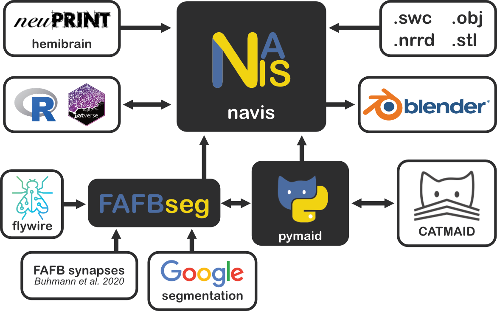

# {{ navis }} & Friends

{{ navis }} comes with batteries included but is also highly extensible. Here are
some libraries that are built directly on top of {{ navis }}.



## template brains + transforms

{{ navis }} provides the scaffolding to work with brain templates and transforms, but it does not ship any itself. Instead, those are provided by separate packages:

#### `flybrains`

[flybrains](https://github.com/navis-org/navis-flybrains) bundles many fly template brains and transforms that {{ navis }} can use to map spatial
data (e.g. neurons) from one brain space to another. If you installed {{ navis }}
via ``pip`` with the ``[flybrains]`` option, you should already have this package.

```python
import navis
import flybrains  # importing registers the transforms with NAVis

# Plot one of the template brains
navis.plot2d(flybrains.JRC2018U)

# Transform neurons to another brain space
n = navis.example_neurons(3, kind='skeleton')
xf = navis.xform_brain(n, source='JRCFIB2018F', target='JRC2018F')
```

#### `fishbrains`

[fishbrains](https://github.com/navis-org/navis-fishbrains) contains template brains and transforms for zebrafish.

#### `mousebrains`

[mousebrains](https://github.com/navis-org/navis-mousebrains/) contains template brains and transforms for mouse.

## pymaid

[pymaid](https://pymaid.readthedocs.io/en/latest/) provides an interface with
[CATMAID](https://catmaid.readthedocs.io/en/stable/) servers. It allows
you to pull data (neurons, connectivity) that can be directly plugged into
{{ navis }}. Conversely, you can also take {{ navis }} neurons and push them to a
CATMAID server. `pymaid` is a great example of how to extend {{ navis }}.

```python
import navis
import pymaid

# Connect to a public CATMAID server
rm = pymaid.CatmaidInstance(server="https://fafb.catmaid.virtualflybrain.org/", api_token=None)

# Fetch some neurons
nl = pymaid.get_neurons('annotation:Paper: Engert et al 2022')

# CATMAID neurons can be directly used in all NAVis functions
navis.plot2d(nl, radius=False)
```

## fafbseg

[fafbseg](https://fafbseg-py.readthedocs.io/en/latest/index.html) contains
tools to work with autosegmented data for the
[FAFB](https://www.temca2data.org) (full adult fly brain)
EM dataset. It brings together data from [FlyWire](https://flywire.ai/),
[Google's](http://fafb-ffn1.storage.googleapis.com/landing.html) segmentation
of FAFB and [synapse predictions](https://github.com/funkelab/synful) by
Buhmann et al. (2019).

```python
from fafbseg import flywire

# Grab a neuron mesh by its ID
n = flywire.get_mesh_neuron(720575940613091290)

# Skeletonize using NAVis
s = navis.skeletonize(n)
```

## natverse

The [natverse](http://natverse.org/) is {{ navis }}'s equivalent in R. While we
are aiming for feature parity, it can be useful to move data between the two.

That happens via R data files, which {{ navis }} reads and writes natively - no
R installation and no ``rpy2`` required on either end:

```python
import navis

nl = navis.example_neurons(3)

# Write to an .rds (single object) or .rda (named objects) file
navis.write_rds(nl, 'neurons.rds')
navis.write_rda({'neurons': nl, 'LH': navis.example_volume('LH')}, 'data.rda')

# ... and read R data files back in
nl2 = navis.read_rds('neurons.rds')
```

``` r
# In R:
library(nat)
nl <- readRDS('neurons.rds')
plot3d(nl)
```

Skeletons, dotprops, meshes, image data and neuronlists all map onto their
`nat`/`rgl` counterparts. See the
[natverse tutorial](generated/gallery/0_io/tutorial_io_03_r) for the full
round trip.

!!! info "The `rpy2` interface has been retired"

    {{ navis }} used to ship a `navis.interfaces.r` module that called
    ``natverse`` functions through ``rpy2``. It has been removed: the file-based
    exchange above covers the data side without needing R installed, and its
    other functions have native equivalents ([`navis.nblast`][],
    [`navis.xform_brain`][] and [`navis.mirror_brain`][] with
    [flybrains](https://github.com/navis-org/navis-flybrains)).
