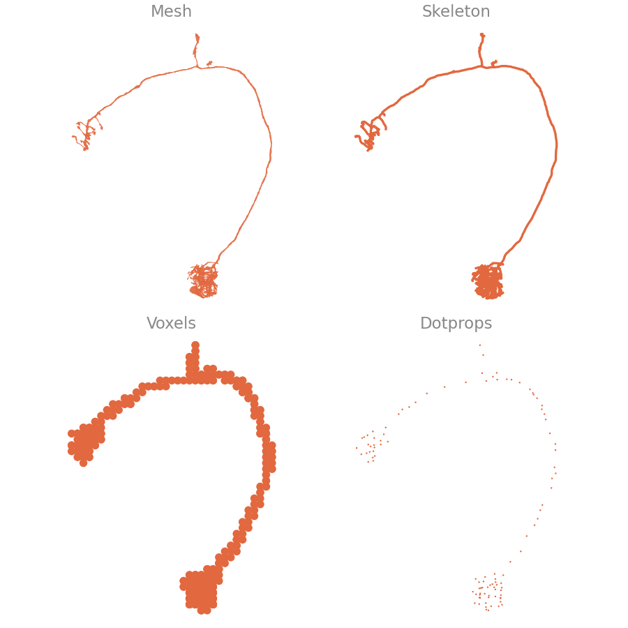
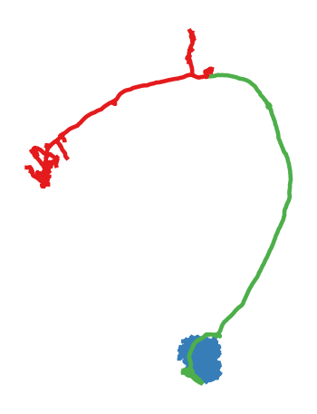
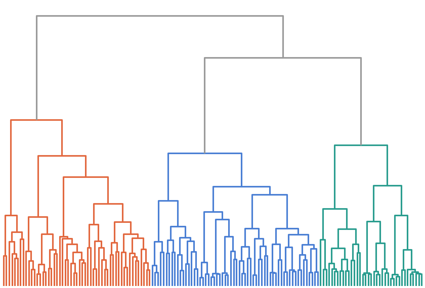

# Examples

{{ navis }} is a Python library for exploring and analyzing neurons. Load them from
local files or remote databases, work with them as skeletons, meshes, dotprops or
voxels, and plot, process and compare them — often in just a few lines.

=== "Neuron in 3D"

    <div class="qs-split" markdown>

    ```python
    import navis

    # a bundled example neuron (mesh)
    m = navis.example_neurons(1, kind="mesh")

    # interactive 3D — spin, zoom, hover
    navis.plot3d(m, color="coral")
    ```

    ```python exec="on" html="1"
    import navis
    navis.config.pbar_hide = True
    m = navis.example_neurons(1, kind="mesh")
    fig = navis.plot3d(m, color="coral", backend="plotly", inline=False)
    fig.update_layout(
        margin=dict(l=0, r=0, t=0, b=0), paper_bgcolor="rgba(0,0,0,0)", showlegend=False,
        scene=dict(xaxis_visible=False, yaxis_visible=False, zaxis_visible=False),
    )
    print(fig.to_html(full_html=False, include_plotlyjs="cdn", default_height="380px",
                      config={"displayModeBar": False, "responsive": True}))
    ```

    </div>

=== "Neuron types"

    <div class="qs-split" markdown>

    ```python
    import navis

    # start from a mesh
    m = navis.example_neurons(1, kind="mesh")

    # convert it into the other neuron types
    sk = navis.skeletonize(m)                 # Skeleton
    vx = navis.voxelize(m, pitch="1 micron")  # Voxels
    dp = navis.make_dotprops(m, k=5)          # Dotprops
    ```

    { .off-glb }

    </div>

=== "Axon & dendrite"

    <div class="qs-split" markdown>

    ```python
    import navis

    n = navis.example_neurons(1, kind="skeleton")

    # split into axon, dendrite & linker by synapse flow
    split = navis.split_axon_dendrite(n)

    navis.plot2d(split, color_by="compartment")
    ```

    { .off-glb }

    </div>

=== "NBLAST clustering"

    <div class="qs-split" markdown>

    ```python
    import navis
    import navis.interfaces.neuprint as neu

    # connect to a neuPrint dataset
    client = neu.Client("https://neuprint.janelia.org", dataset="male-cns:v1.0")

    # fetch all right antennal-lobe projection neurons
    sk = neu.fetch_skeletons(neu.NeuronCriteria(class_="ALPN", somaSide="R"))

    # cluster them by NBLAST morphological similarity
    dp = navis.make_dotprops(sk, k=5)
    scores = navis.nblast_allbyall(dp.convert_units("um"))
    ```

    { .off-glb }

    </div>
